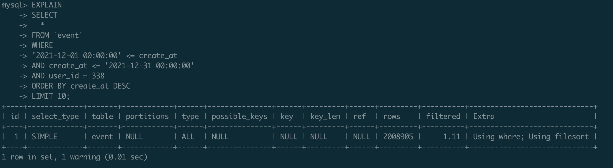
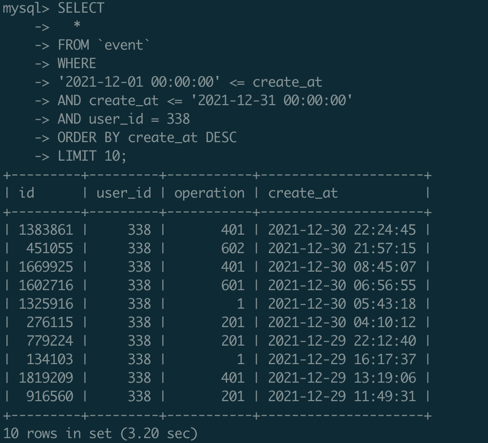

# 環境
- MacBook Pro M1
- docker 
- mysql5.7

# 建立測試資料
- 建立Table
```SQL
DROP TABLE IF EXISTS `event`;

CREATE TABLE `event` (
  `id` MEDIUMINT UNSIGNED NOT NULL AUTO_INCREMENT,
  `user_id` MEDIUMINT UNSIGNED NOT NULL,
  `operation` SMALLINT NOT NULL,
  `create_at` TIMESTAMP NOT NULL DEFAULT CURRENT_TIMESTAMP,

  PRIMARY KEY (`id`)
);
```

- 建立procedure
```SQL
-- 建立1000萬筆資料
-- user_id : 1 ~ 1000
-- operation : 0 ~ 999
-- create_at : 2021-01-01 ~ 2022-01-01
-- macbook pro M1 use docker : spend 12 min to create 2M data
DROP PROCEDURE `generate_event_data`;

DELIMITER $$
CREATE PROCEDURE generate_event_data()
BEGIN
  DECLARE i INT DEFAULT 0;
  WHILE i < 2000000 DO
    INSERT INTO `event` (`user_id`,`operation`,`create_at`) VALUES (
      FLOOR(RAND() * 1000) + 1,
      FLOOR(RAND() * 1000),
      FROM_UNIXTIME(UNIX_TIMESTAMP('2021-01-01 01:00:00') + FLOOR(RAND() * 31536000))
    );
    IF MOD(i, 100) = 0 THEN 
        SELECT "create", i, "records";
    END IF;
    
    SET i = i + 1;
  END WHILE;
  SELECT "generate_event_data() finish";
END$$
DELIMITER ;

CALL generate_event_data();
```

# 測試項目
- 查詢指定用戶時間內最近10個事件

```SQL
SELECT
  *
FROM `event`
WHERE
'2021-12-01 00:00:00' <= create_at 
AND create_at <= '2021-12-31 00:00:00'
AND user_id = 338
ORDER BY create_at DESC
LIMIT 10;
```

1. nothing




2. add index on `user_id` and `create_at`


3. create partition by range on `create_at`


- 查詢指定用戶時間內最新的不同事件